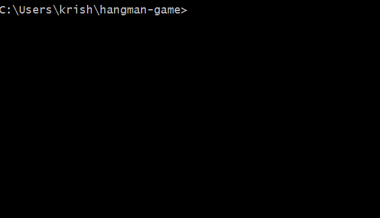
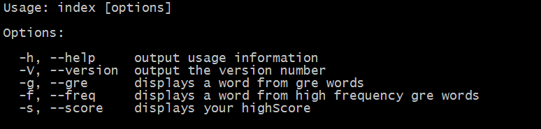

# hangman-game
Guess the word ! Improve vocabulary ! Have fun !




[](https://gitter.im/hangman-game/Lobby?utm_source=badge&utm_medium=badge&utm_campaign=pr-badge&utm_content=badge)
[](http://standardjs.com/)

Motivation
------
* Do you want to improve your English vocabulary?
* Are you studying for GRE/TOEFL?
* Are you bored of memorizing words and meanings?
* Are you looking for a fun way to memorize?

Install
------

```bash
npm install -g hangman-game
```

Play
------
```
$ hangman
```



Test
------

```bash
$ npm test
```

Contributing
------
__Bugs and requests__: submit them through the project's issues tracker.<br>
[]( https://github.com/argonlaser/hangman-game/issues )
__PRs always welcome !__

Thanks
------
Thanks to the awesome packages, that makes this project possible.
```json
"dependencies": {
  "cli-table": "^0.3.1",
  "colors": "^1.1.2",
  "commander": "^2.9.0",
  "fs": "0.0.1-security",
  "keypress": "^0.2.1"
}
```
```json
"devDependencies": {
  "chai": "^3.5.0",
  "mocha": "^2.3.3",
  "standard": "^8.1.0"
}
```

Contributors
--------
**hangman-game** © 2016, Venkata krishna Sundararajan. Released under the [MIT License].<br>
Authored and maintained by Venkata krishna Sundararajan with help from [contributors].

> GitHub [@argonlaser](https://github.com/argonlaser) &nbsp;&middot;&nbsp;
> Twitter [@argon_laser](https://twitter.com/argon_laser)

[MIT License]: http://mit-license.org/
[contributors]: http://github.com/argonlaser/hangman-game/contributors
